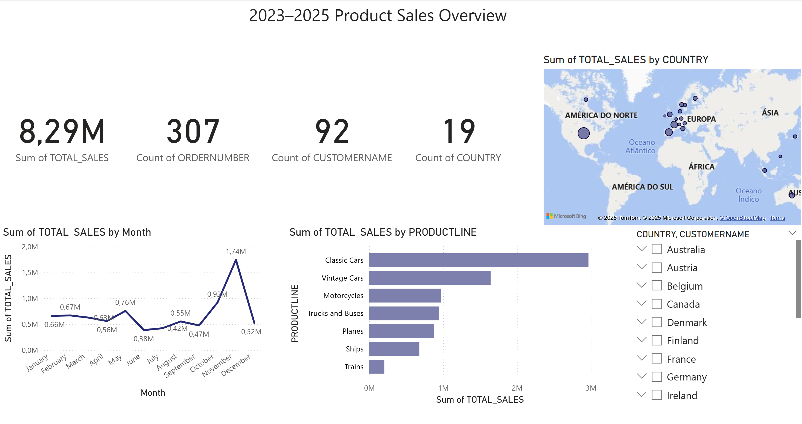

# E-commerce Sales Analysis Dashboard with Power BI

## 1. Project Overview
This project is a data analysis project using sales data from an e-commerce platform. The goal is to extract insights and visualize key business metrics using Power BI, covering monthly sales trends, top-performing countries, and product categories.

## 2. Dataset
The dataset contains sales transaction records from an online store, including fields such as:
- Date of sale
- Country
- Product line
- Quantity ordered
- Price per unit

The original CSV file: sales_data_sample.csv

## 3. Tools
- Python (pandas, numpy) — for data cleaning & preprocessing
- Excel / CSV — to store intermediate results
- Power BI — to build interactive dashboards

## 4. Workflow
1. Cleaned raw sales data using Python (handled missing values, calculated `TOTAL_SALES`)
2. Aggregated monthly, country-wise, and product-line sales data
3. Exported processed data as CSV
4. Imported data into Power BI and created the following visualizations:
   - KPI Cards
   - Line Chart (Monthly Sales)
   - Bar Chart (Sales by Product Lines)
   - Map & Slicer (Size by Countries)

## 5. Visualizations

## 6. Conclusion
This analysis offers a clear view of how sales differ across time, countries, and products. It also shows how Power BI can turn static data into business insights.

## 7. How to Run This Project
### Option A: View Dashboard PDF
- Check out the exported dashboard in `project1.pdf`

### Option B: Rebuild in Power BI
1. Open `Power BI Desktop`
2. Load `monthly_sales.csv`, `country_sales.csv`, and `top_products.csv`
3. Recreate charts as shown in this README
4. Arrange layout using **card**, **line**, **bar**, **column** visual elements

## 8. Folder Structure
Project1-ecommerce-sales-analysis/
├── country_sales.csv
├── monthly_sales.csv
├── sales_data_sample.csv
├── top_products.csv
├── Dashboard.png
├── data_cleaning.ipynb
├── project1.pbix
└── project1.pdf
